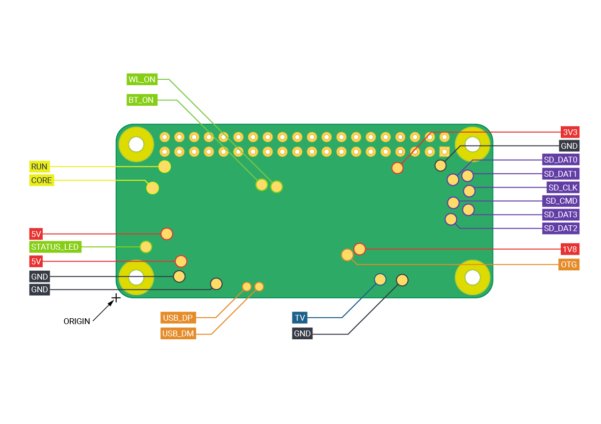

# review rev.20251119

- review the schematic
- check the BOM avaliability at LCSC

## Power
- 5V from TYPE-C 2A fuse
- CC1,2 5.1k to GND
- 3V3 is used from RPIZ, 1A max
- PPIZ typical consumption is 0,1 - 0,35A
- *add power rails LEDs?*
- 
## ADC
- 820k/120k 1% divider + 6M Ohm input of ADS1015 gives together up to 4% error
  - *use smaller divider*
- RC filtering for AINx advised
  - *add caps after dividers*
- ALERT/RDY is not used, RPI drivers dont require to connect it

## Relays
- ZXBM5210 **NRND**
- *add 100uF cap to 5V*
- *add cap to 3V3*
- *latch type relays could save the current, but it's always ON *
  - *add standby state or switch to general type, reducing parts needed*

## Qwiic connector
- *add a fuse to 3V3 output*

## Addons connector
- *add a fuse to 5V output*

## USB
- **USB from type-C J1 USB_D goes nowhere**
  - *maybe consider placing an USB-UART here?*
- power switches - USB_FLT collects 4 faults, 
  - *could be separated to know exactly where the error occures*
- where it comes from? RPI zero tespads 
  - *5V pins are availible through the 40-pin header, but not used. Why nusing pogopin instead?*

|Label |Function|X|Y|
|--|--|--|--|
|5V|5V input|8.75|11.05|
|5V|5V input|11.21|6.3|
|GND|Ground pin|10.9|3.69|
|GND|Ground pin|17.29|2.41|
|USB_DP|USB port|22.55|1.92|
|USB_DM|USB port|24.68|1.92|

## Digitla inputs
- **User should know that even if it's possible to use up to 24V for these inputs, it's not compatible with Industrial Digital Inputs (DI)** adhere to IEC 61131-2 standards, typically classified as Type 1 or Type 3, which define the voltage limits for switching between ON and OFF. Signal OFF (Low) Limits: Typically 0V to 5V. Signal ON (High) Limits: Typically 11V to 30V.

## ideas
- add the 40-pin header to connect other HATS

## LCSC parts availiability
- EC2-5SNU(relay) unavailible, EC2-3NU(sch is not directly compatible) or search 
- LEDs unavailible(easy subs)
- ZXBM5210-S (DC motor driver) unavailible
- MIC2026-2YM (USB power switch) 1 pcs.left, MIC2026A availible
- USB1125-GF-B(connector) 11pcs. left
- FE1.1s(USB HUB), need to check if PN is right (FE1.1S-BSOP28BCN 23k+)

## analyze TODO.md <!-- todo -->
### FE1.1s
- unconnect pin 27 (TEST)
- unconnect pins 12 and 13
- unconnect pin 28
- put 3.3 thru devider 5.1k/10k to VBUSM pin 18
- no need for 1.8v 10u cap
- 12pF caps near quarz crystal
- OVCJ pull-up put near chip on schematic to make the block transferrable

## resources
- [ADS1015](https://www.ti.com/lit/ds/symlink/ads1015.pdf)
- [RPI Zero 2W](https://pip-assets.raspberrypi.com/categories/584-raspberry-pi-zero-2-w/documents/RP-008360-DS-1-raspberry-pi-zero-2-w-reduced-schematics.pdf?disposition=inline) 
  - [step-down reg RPIZ](https://www.diodes.com/assets/Datasheets/PAM2306.pdf) 1A 3V3